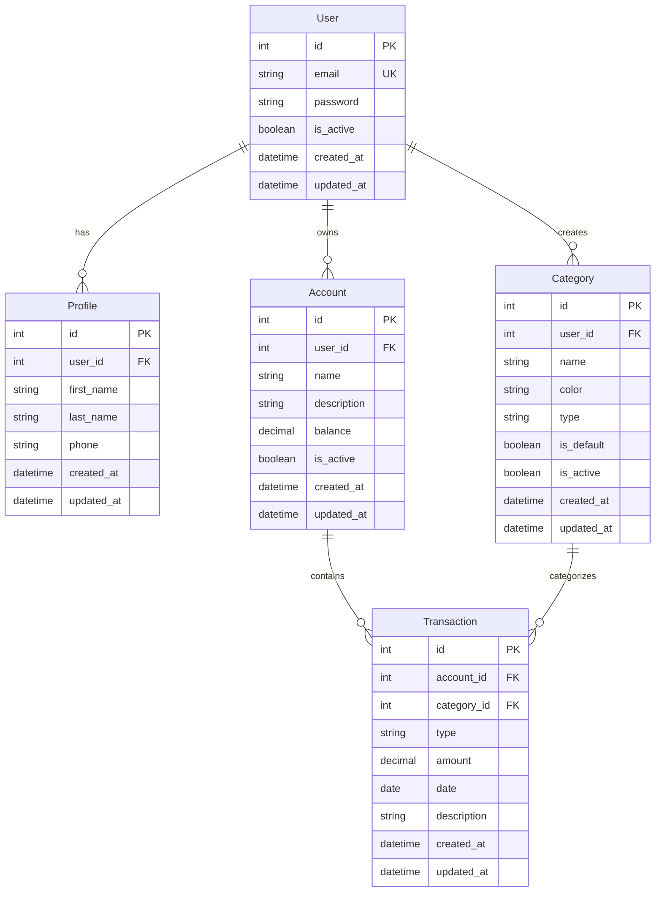

# 5. Schema do Banco de Dados

O diagrama abaixo representa a estrutura das principais entidades do banco de dados do Finanpy.

```mermaid
erDiagram
    User ||--o{ Profile : has
    User ||--o{ Account : owns
    User ||--o{ Category : creates
    Account ||--o{ Transaction : contains
    Category ||--o{ Transaction : categorizes

    User {
        int id PK
        string email UK
        string password
        boolean is_active
        datetime created_at
        datetime updated_at
    }

    Profile {
        int id PK
        int user_id FK
        string first_name
        string last_name
        string phone
        datetime created_at
        datetime updated_at
    }

    Account {
        int id PK
        int user_id FK
        string name
        string description
        decimal balance
        boolean is_active
        datetime created_at
        datetime updated_at
    }

    Category {
        int id PK
        int user_id FK
        string name
        string color
        string type
        boolean is_default
        boolean is_active
        datetime created_at
        datetime updated_at
    }

    Transaction {
        int id PK
        int account_id FK
        int category_id FK
        string type
        decimal amount
        date date
        string description
        datetime created_at
        datetime updated_at
    }
```
