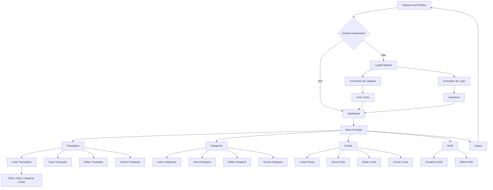
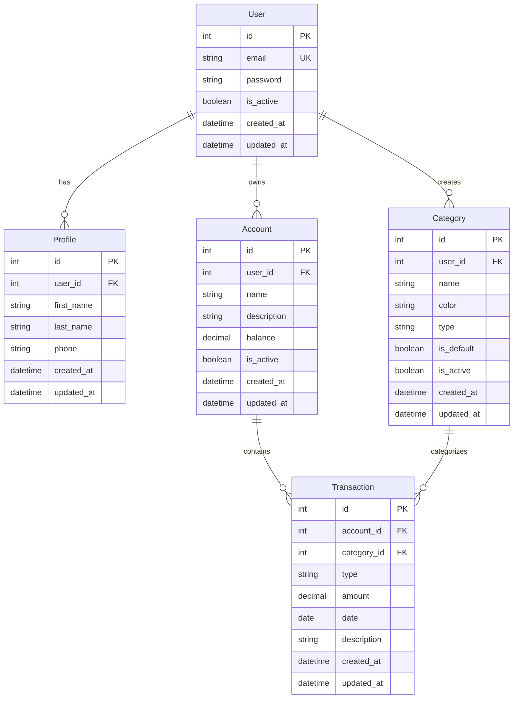

# PRD - Finanpy
## Product Requirement Document

---

## 1. Visão Geral

O Finanpy é um sistema web de gestão de finanças pessoais desenvolvido com Django full stack, oferecendo uma solução simples e eficiente para controle financeiro individual. O sistema permitirá que usuários registrem, categorizem e acompanhem suas transações financeiras através de uma interface moderna e intuitiva.

---

## 2. Sobre o Produto

Sistema de gestão financeira pessoal construído com Django, utilizando templates nativos (DTL) estilizados com TailwindCSS. A aplicação oferece funcionalidades essenciais para controle de receitas e despesas, com foco em simplicidade e usabilidade, sem over-engineering.

---

## 3. Propósito

- Facilitar o controle financeiro pessoal de forma simples e acessível
- Proporcionar visibilidade sobre receitas, despesas e saldo
- Permitir categorização de transações para melhor organização
- Oferecer uma experiência de usuário fluida e moderna
- Ser uma ferramenta leve e de fácil manutenção

---

## 4. Público Alvo

- Pessoas físicas que desejam organizar suas finanças pessoais
- Usuários que buscam uma solução simples, sem complexidade excessiva
- Público brasileiro que valoriza interface em português
- Faixa etária: 18-60 anos
- Perfil: usuários com conhecimento básico de tecnologia

---

## 5. Objetivos

### 5.1 Objetivos de Negócio
- Criar um MVP funcional de sistema de gestão financeira pessoal
- Estabelecer base sólida para futuras expansões (multitenant)
- Desenvolver solução escalável e de fácil manutenção

### 5.2 Objetivos de Produto
- Interface intuitiva e responsiva
- Performance adequada para uso individual
- Registro e visualização de transações financeiras
- Categorização de receitas e despesas
- Dashboard com visão geral das finanças

### 5.3 Objetivos Técnicos
- Código limpo seguindo PEP8 e clean code
- Arquitetura modular com apps Django separados
- Utilização de recursos nativos do Django
- Sistema de logging estruturado

---

## 6. Requisitos Funcionais

### 6.1 Autenticação e Acesso
- RF01: Sistema deve permitir cadastro de novos usuários via email
- RF02: Sistema deve permitir login via email e senha
- RF03: Sistema deve permitir logout
- RF04: Sistema deve permitir recuperação de senha
- RF05: Sistema deve ter página pública de apresentação

### 6.2 Perfil de Usuário
- RF06: Usuário deve poder visualizar seu perfil
- RF07: Usuário deve poder editar informações do perfil
- RF08: Sistema deve armazenar dados básicos do usuário

### 6.3 Categorias
- RF09: Sistema deve ter categorias pré-definidas de receitas e despesas
- RF10: Usuário deve poder criar categorias personalizadas
- RF11: Usuário deve poder editar categorias personalizadas
- RF12: Usuário deve poder excluir categorias personalizadas (sem transações)
- RF13: Categorias devem ter nome, cor e tipo (receita/despesa)

### 6.4 Contas/Accounts
- RF14: Usuário deve poder criar contas financeiras (carteira, banco, etc)
- RF15: Usuário deve poder editar contas
- RF16: Usuário deve poder excluir contas (sem transações)
- RF17: Usuário deve visualizar saldo de cada conta
- RF18: Sistema deve suportar múltiplas contas por usuário

### 6.5 Transações
- RF19: Usuário deve poder registrar transações de receita
- RF20: Usuário deve poder registrar transações de despesa
- RF21: Transação deve ter: valor, data, categoria, conta, descrição
- RF22: Usuário deve poder editar transações
- RF23: Usuário deve poder excluir transações
- RF24: Usuário deve poder visualizar lista de transações
- RF25: Usuário deve poder filtrar transações por período
- RF26: Usuário deve poder filtrar transações por categoria
- RF27: Usuário deve poder filtrar transações por conta

### 6.6 Dashboard
- RF28: Dashboard deve exibir saldo total
- RF29: Dashboard deve exibir total de receitas do período
- RF30: Dashboard deve exibir total de despesas do período
- RF31: Dashboard deve exibir transações recentes
- RF32: Dashboard deve exibir gráfico de despesas por categoria
- RF33: Dashboard deve exibir resumo mensal

### 6.7 Flowchart de UX



---

## 7. Requisitos Não-Funcionais

### 7.1 Performance
- RNF01: Páginas devem carregar em menos de 2 segundos
- RNF02: Sistema deve suportar até 1000 transações por usuário sem degradação
- RNF03: Queries ao banco devem ser otimizadas (select_related, prefetch_related)

### 7.2 Usabilidade
- RNF04: Interface deve ser responsiva (mobile, tablet, desktop)
- RNF05: Todas as mensagens devem estar em português brasileiro
- RNF06: Design moderno com tema escuro
- RNF07: Feedback visual para todas as ações do usuário

### 7.3 Segurança
- RNF08: Senhas devem ser armazenadas com hash
- RNF09: Sistema deve usar autenticação nativa do Django
- RNF10: Proteção contra CSRF em todos os formulários
- RNF11: Validação de dados no backend

### 7.4 Manutenibilidade
- RNF12: Código deve seguir PEP8
- RNF13: Código deve seguir princípios de clean code
- RNF14: Usar aspas simples consistentemente
- RNF15: Sistema de logging implementado
- RNF16: Uso de ruff como linter e formatter
- RNF17: Código em inglês, interface em português

### 7.5 Confiabilidade
- RNF18: Sistema deve ter tratamento de erros adequado
- RNF19: Mensagens de erro devem ser claras e em português
- RNF20: Backup automático do SQLite

### 7.6 Portabilidade
- RNF21: Sistema deve funcionar em Linux, macOS e Windows
- RNF22: Python 3.13+
- RNF23: Banco de dados SQLite

---

## 8. Arquitetura Técnica

### 8.1 Stack Tecnológica

**Backend:**
- Python 3.13+
- Django 6.0.1 (latest stable)
- SQLite (banco de dados)

**Frontend:**
- Django Template Language (DTL)
- TailwindCSS 3.x
- JavaScript vanilla (quando necessário)

**Gerenciamento:**
- uv (gerenciador de dependências)
- ruff (linter e formatter)
- python logging (sistema de logs)

**Estrutura:**
- Class-Based Views (CBVs)
- Apps modulares por domínio
- Autenticação nativa do Django

### 8.2 Estrutura de Dados



---

## 9. Design System

### 9.1 Paleta de Cores

**Cores Primárias:**
```css
Primary: #6366f1 (Indigo-500)
Primary Hover: #4f46e5 (Indigo-600)
Primary Dark: #4338ca (Indigo-700)
Secondary: #8b5cf6 (Violet-500)
Accent: #06b6d4 (Cyan-500)
```

**Cores de Fundo:**
```css
Background Primary: #0f172a (Slate-900)
Background Secondary: #1e293b (Slate-800)
Background Tertiary: #334155 (Slate-700)
Surface: #1e293b (Slate-800)
```

**Cores de Texto:**
```css
Text Primary: #f1f5f9 (Slate-100)
Text Secondary: #cbd5e1 (Slate-300)
Text Muted: #64748b (Slate-500)
```

**Cores de Status:**
```css
Success: #10b981 (Emerald-500)
Warning: #f59e0b (Amber-500)
Error: #ef4444 (Red-500)
Info: #3b82f6 (Blue-500)
```

**Gradientes:**
```css
Gradient Primary: from-indigo-500 to-violet-500
Gradient Secondary: from-cyan-500 to-blue-500
Gradient Accent: from-violet-500 to-purple-500
```

### 9.2 Tipografia

**Fontes:**
```css
Font Family: 'Inter', system-ui, sans-serif
Font Sizes:
  - xs: 0.75rem (12px)
  - sm: 0.875rem (14px)
  - base: 1rem (16px)
  - lg: 1.125rem (18px)
  - xl: 1.25rem (20px)
  - 2xl: 1.5rem (24px)
  - 3xl: 1.875rem (30px)
  - 4xl: 2.25rem (36px)
```

### 9.3 Componentes

**Botões:**
```html
<!-- Botão Primário -->
<button class="px-6 py-3 bg-gradient-to-r from-indigo-500 to-violet-500 text-white rounded-lg font-semibold hover:from-indigo-600 hover:to-violet-600 transition-all duration-200 shadow-lg hover:shadow-xl">
  Texto do Botão
</button>

<!-- Botão Secundário -->
<button class="px-6 py-3 bg-slate-700 text-slate-100 rounded-lg font-semibold hover:bg-slate-600 transition-all duration-200">
  Texto do Botão
</button>

<!-- Botão Outline -->
<button class="px-6 py-3 border-2 border-indigo-500 text-indigo-400 rounded-lg font-semibold hover:bg-indigo-500/10 transition-all duration-200">
  Texto do Botão
</button>
```

**Inputs:**
```html
<!-- Input Text -->
<input type="text" class="w-full px-4 py-3 bg-slate-800 border border-slate-700 rounded-lg text-slate-100 placeholder-slate-500 focus:outline-none focus:ring-2 focus:ring-indigo-500 focus:border-transparent transition-all duration-200" placeholder="Digite aqui...">

<!-- Input com Label -->
<div class="space-y-2">
  <label class="block text-sm font-semibold text-slate-300">Nome do Campo</label>
  <input type="text" class="w-full px-4 py-3 bg-slate-800 border border-slate-700 rounded-lg text-slate-100 placeholder-slate-500 focus:outline-none focus:ring-2 focus:ring-indigo-500 focus:border-transparent transition-all duration-200">
</div>
```

**Cards:**
```html
<!-- Card Padrão -->
<div class="bg-slate-800 rounded-xl p-6 border border-slate-700 shadow-lg hover:shadow-xl transition-all duration-200">
  <h3 class="text-xl font-bold text-slate-100 mb-2">Título do Card</h3>
  <p class="text-slate-300">Conteúdo do card</p>
</div>

<!-- Card com Gradiente -->
<div class="bg-gradient-to-br from-slate-800 to-slate-900 rounded-xl p-6 border border-slate-700/50 shadow-lg">
  <h3 class="text-xl font-bold text-slate-100 mb-2">Título do Card</h3>
  <p class="text-slate-300">Conteúdo do card</p>
</div>
```

**Forms:**
```html
<form class="space-y-6 bg-slate-800 rounded-xl p-8 border border-slate-700">
  <div class="space-y-2">
    <label class="block text-sm font-semibold text-slate-300">Email</label>
    <input type="email" class="w-full px-4 py-3 bg-slate-900 border border-slate-700 rounded-lg text-slate-100 focus:outline-none focus:ring-2 focus:ring-indigo-500 focus:border-transparent">
  </div>
  
  <div class="space-y-2">
    <label class="block text-sm font-semibold text-slate-300">Senha</label>
    <input type="password" class="w-full px-4 py-3 bg-slate-900 border border-slate-700 rounded-lg text-slate-100 focus:outline-none focus:ring-2 focus:ring-indigo-500 focus:border-transparent">
  </div>
  
  <button type="submit" class="w-full px-6 py-3 bg-gradient-to-r from-indigo-500 to-violet-500 text-white rounded-lg font-semibold hover:from-indigo-600 hover:to-violet-600 transition-all duration-200">
    Entrar
  </button>
</form>
```

**Grid Layout:**
```html
<!-- Grid Responsivo 2 Colunas -->
<div class="grid grid-cols-1 md:grid-cols-2 gap-6">
  <!-- Conteúdo -->
</div>

<!-- Grid Responsivo 3 Colunas -->
<div class="grid grid-cols-1 md:grid-cols-2 lg:grid-cols-3 gap-6">
  <!-- Conteúdo -->
</div>

<!-- Grid Responsivo 4 Colunas -->
<div class="grid grid-cols-1 sm:grid-cols-2 lg:grid-cols-4 gap-6">
  <!-- Conteúdo -->
</div>
```

**Menu/Navegação:**
```html
<!-- Navbar -->
<nav class="bg-slate-800 border-b border-slate-700 sticky top-0 z-50">
  <div class="container mx-auto px-4 py-4">
    <div class="flex items-center justify-between">
      <div class="flex items-center space-x-8">
        <h1 class="text-2xl font-bold bg-gradient-to-r from-indigo-400 to-violet-400 bg-clip-text text-transparent">Finanpy</h1>
        <div class="hidden md:flex space-x-6">
          <a href="#" class="text-slate-300 hover:text-indigo-400 transition-colors">Dashboard</a>
          <a href="#" class="text-slate-300 hover:text-indigo-400 transition-colors">Transações</a>
          <a href="#" class="text-slate-300 hover:text-indigo-400 transition-colors">Categorias</a>
        </div>
      </div>
      <div class="flex items-center space-x-4">
        <span class="text-slate-300">Usuário</span>
        <button class="px-4 py-2 bg-slate-700 rounded-lg hover:bg-slate-600 transition-colors">Sair</button>
      </div>
    </div>
  </div>
</nav>

<!-- Sidebar -->
<aside class="w-64 bg-slate-800 border-r border-slate-700 h-screen sticky top-0">
  <div class="p-6">
    <h2 class="text-xl font-bold bg-gradient-to-r from-indigo-400 to-violet-400 bg-clip-text text-transparent mb-6">Finanpy</h2>
    <nav class="space-y-2">
      <a href="#" class="flex items-center space-x-3 px-4 py-3 rounded-lg bg-indigo-500/10 text-indigo-400 font-semibold">
        <span>Dashboard</span>
      </a>
      <a href="#" class="flex items-center space-x-3 px-4 py-3 rounded-lg text-slate-300 hover:bg-slate-700 hover:text-indigo-400 transition-all">
        <span>Transações</span>
      </a>
      <a href="#" class="flex items-center space-x-3 px-4 py-3 rounded-lg text-slate-300 hover:bg-slate-700 hover:text-indigo-400 transition-all">
        <span>Categorias</span>
      </a>
    </nav>
  </div>
</aside>
```

**Tabelas:**
```html
<div class="bg-slate-800 rounded-xl border border-slate-700 overflow-hidden">
  <table class="w-full">
    <thead class="bg-slate-700/50">
      <tr>
        <th class="px-6 py-4 text-left text-sm font-semibold text-slate-300">Coluna 1</th>
        <th class="px-6 py-4 text-left text-sm font-semibold text-slate-300">Coluna 2</th>
        <th class="px-6 py-4 text-left text-sm font-semibold text-slate-300">Ações</th>
      </tr>
    </thead>
    <tbody class="divide-y divide-slate-700">
      <tr class="hover:bg-slate-700/30 transition-colors">
        <td class="px-6 py-4 text-slate-100">Dado 1</td>
        <td class="px-6 py-4 text-slate-100">Dado 2</td>
        <td class="px-6 py-4">
          <button class="text-indigo-400 hover:text-indigo-300">Editar</button>
        </td>
      </tr>
    </tbody>
  </table>
</div>
```

**Badges:**
```html
<!-- Badge Success -->
<span class="px-3 py-1 bg-emerald-500/10 text-emerald-400 rounded-full text-sm font-semibold border border-emerald-500/20">Receita</span>

<!-- Badge Error -->
<span class="px-3 py-1 bg-red-500/10 text-red-400 rounded-full text-sm font-semibold border border-red-500/20">Despesa</span>

<!-- Badge Info -->
<span class="px-3 py-1 bg-blue-500/10 text-blue-400 rounded-full text-sm font-semibold border border-blue-500/20">Info</span>
```

**Alerts:**
```html
<!-- Alert Success -->
<div class="bg-emerald-500/10 border border-emerald-500/20 text-emerald-400 px-4 py-3 rounded-lg">
  <p class="font-semibold">Sucesso!</p>
  <p class="text-sm">Operação realizada com sucesso.</p>
</div>

<!-- Alert Error -->
<div class="bg-red-500/10 border border-red-500/20 text-red-400 px-4 py-3 rounded-lg">
  <p class="font-semibold">Erro!</p>
  <p class="text-sm">Ocorreu um erro na operação.</p>
</div>
```

### 9.4 Espaçamento e Containers

```html
<!-- Container Principal -->
<div class="container mx-auto px-4 py-8 max-w-7xl">
  <!-- Conteúdo -->
</div>

<!-- Espaçamento Padrão -->
<div class="space-y-6"> <!-- Vertical -->
<div class="space-x-4"> <!-- Horizontal -->

<!-- Padding Padrão -->
p-4: 1rem (16px)
p-6: 1.5rem (24px)
p-8: 2rem (32px)

<!-- Margin Padrão -->
m-4: 1rem (16px)
m-6: 1.5rem (24px)
m-8: 2rem (32px)
```

---

## 10. User Stories

### Épico 1: Autenticação e Cadastro

**US01: Cadastro de Usuário**
- **Como** visitante
- **Quero** me cadastrar no sistema
- **Para** começar a gerenciar minhas finanças

**Critérios de Aceite:**
- [ ] Formulário com campos: email, senha, confirmação de senha
- [ ] Validação de email único
- [ ] Validação de força de senha
- [ ] Confirmação de senha deve coincidir
- [ ] Mensagem de sucesso após cadastro
- [ ] Redirecionamento automático para dashboard após cadastro
- [ ] Email deve ser case-insensitive

**US02: Login de Usuário**
- **Como** usuário cadastrado
- **Quero** fazer login no sistema
- **Para** acessar minhas informações financeiras

**Critérios de Aceite:**
- [ ] Formulário com campos: email e senha
- [ ] Autenticação via email (não username)
- [ ] Mensagem de erro clara para credenciais inválidas
- [ ] Redirecionamento para dashboard após login bem-sucedido
- [ ] Opção "Lembrar-me" funcional

**US03: Recuperação de Senha**
- **Como** usuário
- **Quero** recuperar minha senha
- **Para** acessar o sistema caso esqueça a senha

**Critérios de Aceite:**
- [ ] Link "Esqueci minha senha" na tela de login
- [ ] Formulário solicita email cadastrado
- [ ] Email com link de redefinição enviado
- [ ] Link temporário com validade de 24h
- [ ] Formulário para nova senha
- [ ] Confirmação de alteração bem-sucedida

### Épico 2: Gestão de Perfil

**US04: Visualizar Perfil**
- **Como** usuário logado
- **Quero** visualizar meu perfil
- **Para** verificar minhas informações pessoais

**Critérios de Aceite:**
- [ ] Página de perfil acessível via menu
- [ ] Exibição de: nome, email, telefone
- [ ] Design consistente com o restante do sistema

**US05: Editar Perfil**
- **Como** usuário logado
- **Quero** editar meu perfil
- **Para** manter minhas informações atualizadas

**Critérios de Aceite:**
- [ ] Botão "Editar" na página de perfil
- [ ] Formulário pré-preenchido com dados atuais
- [ ] Campos editáveis: nome, sobrenome, telefone
- [ ] Validação de dados
- [ ] Mensagem de sucesso após salvar
- [ ] Atualização imediata das informações

### Épico 3: Gestão de Contas

**US06: Criar Conta Financeira**
- **Como** usuário logado
- **Quero** criar uma conta financeira
- **Para** organizar meu dinheiro em diferentes contas

**Critérios de Aceite:**
- [ ] Botão "Nova Conta" visível
- [ ] Formulário com campos: nome, descrição, saldo inicial
- [ ] Validação de campos obrigatórios
- [ ] Saldo inicial pode ser positivo ou zero
- [ ] Mensagem de sucesso após criação
- [ ] Redirecionamento para lista de contas

**US07: Listar Contas**
- **Como** usuário logado
- **Quero** visualizar todas minhas contas
- **Para** ter visão geral de onde está meu dinheiro

**Critérios de Aceite:**
- [ ] Lista exibe: nome, saldo atual, descrição
- [ ] Ordenação por nome ou saldo
- [ ] Visual diferenciado para conta ativa/inativa
- [ ] Total geral de todas as contas
- [ ] Design responsivo

**US08: Editar Conta**
- **Como** usuário logado
- **Quero** editar uma conta
- **Para** corrigir informações ou atualizar dados

**Critérios de Aceite:**
- [ ] Botão "Editar" em cada conta
- [ ] Formulário pré-preenchido
- [ ] Possibilidade de ativar/desativar conta
- [ ] Saldo não editável (apenas via transações)
- [ ] Mensagem de confirmação

**US09: Excluir Conta**
- **Como** usuário logado
- **Quero** excluir uma conta
- **Para** remover contas que não uso mais

**Critérios de Aceite:**
- [ ] Botão "Excluir" em cada conta
- [ ] Modal de confirmação antes da exclusão
- [ ] Validação: conta sem transações associadas
- [ ] Mensagem de erro se houver transações
- [ ] Mensagem de sucesso após exclusão

### Épico 4: Gestão de Categorias

**US10: Criar Categoria Personalizada**
- **Como** usuário logado
- **Quero** criar categorias personalizadas
- **Para** classificar minhas transações de forma específica

**Critérios de Aceite:**
- [ ] Botão "Nova Categoria"
- [ ] Formulário com: nome, tipo (receita/despesa), cor
- [ ] Seletor de cores visual
- [ ] Validação de nome único por tipo
- [ ] Preview da categoria antes de salvar
- [ ] Mensagem de sucesso

**US11: Listar Categorias**
- **Como** usuário logado
- **Quero** visualizar categorias disponíveis
- **Para** saber quais posso usar nas transações

**Critérios de Aceite:**
- [ ] Separação visual entre receitas e despesas
- [ ] Identificação de categorias padrão vs personalizadas
- [ ] Exibição da cor escolhida
- [ ] Indicador de categorias ativas/inativas
- [ ] Filtro por tipo (receita/despesa)

**US12: Editar Categoria**
- **Como** usuário logado
- **Quero** editar categorias personalizadas
- **Para** ajustar nome ou cor conforme necessário

**Critérios de Aceite:**
- [ ] Apenas categorias personalizadas editáveis
- [ ] Categorias padrão não podem ser editadas
- [ ] Formulário pré-preenchido
- [ ] Validação de dados
- [ ] Atualização refletida em transações existentes

**US13: Excluir Categoria**
- **Como** usuário logado
- **Quero** excluir categorias personalizadas
- **Para** manter apenas as que utilizo

**Critérios de Aceite:**
- [ ] Apenas categorias personalizadas podem ser excluídas
- [ ] Validação: categoria sem transações
- [ ] Modal de confirmação
- [ ] Mensagem de erro se houver transações
- [ ] Sugestão de reatribuir transações antes de excluir

### Épico 5: Gestão de Transações

**US14: Registrar Receita**
- **Como** usuário logado
- **Quero** registrar uma receita
- **Para** acompanhar minhas entradas de dinheiro

**Critérios de Aceite:**
- [ ] Botão "Nova Receita"
- [ ] Formulário com: valor, data, categoria, conta, descrição
- [ ] Apenas categorias de receita disponíveis
- [ ] Data padrão: hoje
- [ ] Validação de valor positivo
- [ ] Saldo da conta atualizado automaticamente
- [ ] Mensagem de sucesso

**US15: Registrar Despesa**
- **Como** usuário logado
- **Quero** registrar uma despesa
- **Para** acompanhar meus gastos

**Critérios de Aceite:**
- [ ] Botão "Nova Despesa"
- [ ] Formulário com: valor, data, categoria, conta, descrição
- [ ] Apenas categorias de despesa disponíveis
- [ ] Data padrão: hoje
- [ ] Validação de valor positivo
- [ ] Saldo da conta atualizado automaticamente (subtraído)
- [ ] Mensagem de sucesso

**US16: Listar Transações**
- **Como** usuário logado
- **Quero** visualizar todas minhas transações
- **Para** acompanhar meu histórico financeiro

**Critérios de Aceite:**
- [ ] Lista ordenada por data (mais recente primeiro)
- [ ] Exibição: data, valor, categoria, conta, tipo, descrição
- [ ] Diferenciação visual entre receita e despesa
- [ ] Paginação (20 itens por página)
- [ ] Responsivo em mobile

**US17: Filtrar Transações**
- **Como** usuário logado
- **Quero** filtrar transações
- **Para** encontrar informações específicas

**Critérios de Aceite:**
- [ ] Filtro por período (data início e fim)
- [ ] Filtro por categoria (múltipla seleção)
- [ ] Filtro por conta (múltipla seleção)
- [ ] Filtro por tipo (receita/despesa)
- [ ] Combinação de filtros
- [ ] Botão "Limpar filtros"
- [ ] Total filtrado exibido

**US18: Editar Transação**
- **Como** usuário logado
- **Quero** editar uma transação
- **Para** corrigir erros ou atualizar informações

**Critérios de Aceite:**
- [ ] Botão "Editar" em cada transação
- [ ] Formulário pré-preenchido
- [ ] Todos os campos editáveis
- [ ] Recálculo automático de saldos
- [ ] Validação de dados
- [ ] Mensagem de confirmação

**US19: Excluir Transação**
- **Como** usuário logado
- **Quero** excluir uma transação
- **Para** remover registros incorretos

**Critérios de Aceite:**
- [ ] Botão "Excluir" em cada transação
- [ ] Modal de confirmação
- [ ] Ajuste automático do saldo da conta
- [ ] Mensagem de sucesso
- [ ] Ação irreversível com aviso claro

### Épico 6: Dashboard e Visualizações

**US20: Dashboard Principal**
- **Como** usuário logado
- **Quero** visualizar um dashboard
- **Para** ter visão geral das minhas finanças

**Critérios de Aceite:**
- [ ] Cards com: saldo total, receitas do mês, despesas do mês
- [ ] Lista de transações recentes (últimas 5)
- [ ] Gráfico de despesas por categoria
- [ ] Comparativo mês atual vs mês anterior
- [ ] Período padrão: mês atual
- [ ] Atualização automática ao adicionar transação

**US21: Seleção de Período**
- **Como** usuário logado
- **Quero** selecionar diferentes períodos
- **Para** analisar minhas finanças em diferentes momentos

**Critérios de Aceite:**
- [ ] Seletor de período no dashboard
- [ ] Opções: semana atual, mês atual, mês anterior, ano atual, personalizado
- [ ] Período personalizado: data início e fim
- [ ] Atualização de todos os dados ao mudar período
- [ ] Persistência da seleção durante a sessão

---

## 11. Métricas de Sucesso

### 11.1 KPIs de Produto

**Adoção:**
- [ ] Número de usuários cadastrados
- [ ] Taxa de conclusão de cadastro
- [ ] Tempo médio para primeiro registro de transação

**Engajamento:**
- [ ] Número médio de transações por usuário/mês
- [ ] Frequência de acesso (DAU/MAU)
- [ ] Tempo médio de sessão
- [ ] Taxa de retorno semanal

**Funcionalidade:**
- [ ] Número médio de categorias criadas por usuário
- [ ] Número médio de contas por usuário
- [ ] Utilização de filtros (% de usuários que usam)
- [ ] Visualização do dashboard (% sessões que acessam)

### 11.2 KPIs Técnicos

**Performance:**
- [ ] Tempo de carregamento médio das páginas (< 2s)
- [ ] Taxa de erro de requisições (< 1%)
- [ ] Uptime do sistema (> 99%)

**Qualidade:**
- [ ] Cobertura de código (meta: 80% - sprint final)
- [ ] Número de bugs críticos (meta: 0)
- [ ] Conformidade com PEP8 (100%)

### 11.3 KPIs de Usuário

**Satisfação:**
- [ ] Taxa de conclusão de tarefas (> 90%)
- [ ] Número de erros de usuário por sessão
- [ ] Feedback de usuários (NPS - sprint final)

**Usabilidade:**
- [ ] Taxa de sucesso no primeiro uso
- [ ] Número de cliques para completar ações principais
- [ ] Taxa de abandono de formulários

---

## 12. Riscos e Mitigações

### 12.1 Riscos Técnicos

| Risco | Probabilidade | Impacto | Mitigação |
|-------|---------------|---------|-----------|
| Complexidade do SQLite para múltiplos usuários | Média | Baixo | Documentar limitações; planejar migração futura |
| Performance com muitas transações | Baixa | Médio | Implementar paginação e índices adequados |
| Inconsistência de saldos | Baixa | Alto | Implementar transactions do Django; logging detalhado |
| Problemas com sincronização de dados | Baixa | Médio | Usar F() expressions e select_for_update |

### 12.2 Riscos de Produto

| Risco | Probabilidade | Impacto | Mitigação |
|-------|---------------|---------|-----------|
| Complexidade excessiva na UI | Média | Alto | Validar com usuários; manter design simples |
| Curva de aprendizado alta | Baixa | Médio | Implementar tour guiado; documentação clara |
| Falta de features esperadas | Média | Médio | Pesquisa com usuários; roadmap transparente |

### 12.3 Riscos de Projeto

| Risco | Probabilidade | Impacto | Mitigação |
|-------|---------------|---------|-----------|
| Scope creep | Alta | Alto | PRD bem definido; revisões de sprint |
| Over-engineering | Média | Médio | Code review; seguir princípios KISS e YAGNI |
| Atrasos no cronograma | Média | Médio | Sprints curtas; buffer de tempo |
| Falta de documentação | Baixa | Médio | Documentar durante desenvolvimento |


---

## 13. Cronograma Resumido

| Sprint | Duração | Foco Principal | Status |
|--------|---------|----------------|--------|
| 1 | 1 semana | Setup e Infraestrutura | [ ] |
| 2 | 1 semana | Models e Banco de Dados | [ ] |
| 3 | 1 semana | Autenticação e Landing | [ ] |
| 4 | 1 semana | Dashboard e Navegação | [ ] |
| 5 | 1 semana | CRUD de Contas | [ ] |
| 6 | 1 semana | CRUD de Categorias | [ ] |
| 7 | 1-2 semanas | CRUD de Transações | [ ] |
| 8 | 1 semana | Perfil e UX | [ ] |
| 9 | 1 semana | Dashboard e Relatórios | [ ] |
| 10 | 1 semana | Otimizações e Polimento | [ ] |
| 11 | 1 semana | Testes | [ ] |
| 12 | 1 semana | Docker e Deploy | [ ] |
| 13 | 2 semanas | Multitenant (Futuro) | [ ] |

**Total estimado:** 12-14 semanas para MVP completo

---

## 14. Próximos Passos

1. **Revisar e validar** este PRD com stakeholders
2. **Priorizar** features essenciais vs. nice-to-have
3. **Iniciar Sprint 1** com setup do projeto
4. **Configurar** repositório Git e controle de versão
5. **Estabelecer** rotina de code review
6. **Documentar** decisões técnicas importantes

---

## 15. Glossário

- **CBV**: Class-Based View (View baseada em classe do Django)
- **CRUD**: Create, Read, Update, Delete (Criar, Ler, Atualizar, Deletar)
- **DTL**: Django Template Language (Linguagem de Templates do Django)
- **MVP**: Minimum Viable Product (Produto Mínimo Viável)
- **ORM**: Object-Relational Mapping (Mapeamento Objeto-Relacional)
- **PEP8**: Python Enhancement Proposal 8 (Guia de estilo para código Python)
- **PRD**: Product Requirement Document (Documento de Requisitos do Produto)
- **UI**: User Interface (Interface do Usuário)
- **UX**: User Experience (Experiência do Usuário)
- **SQLite**: Sistema de gerenciamento de banco de dados relacional embutido
- **TailwindCSS**: Framework CSS utility-first para estilização
- **Signal**: Mecanismo de notificação do Django para ações de modelos
- **Migration**: Arquivo que define mudanças no schema do banco de dados
- **QuerySet**: Coleção de queries ao banco de dados no Django
- **Middleware**: Componente que processa requests/responses no Django
- **Artifact**: Componente ou resultado tangível de uma sprint

---

## 16. Apêndices

### Apêndice A: Comandos Úteis

```bash
# Inicializar projeto
uv init
uv sync

# Criar app Django
python manage.py startapp <app_name>

# Migrations
python manage.py makemigrations
python manage.py migrate
python manage.py showmigrations

# Servidor de desenvolvimento
python manage.py runserver

# Shell interativo
python manage.py shell

# Criar superuser
python manage.py createsuperuser

# Coletar arquivos estáticos
python manage.py collectstatic

# Verificar problemas
python manage.py check

# Linting e formatação
ruff check .
ruff format .

# Testes (quando implementados)
python manage.py test
pytest
coverage run -m pytest
coverage report
```

### Apêndice B: Estrutura de Diretórios Completa

```
finanpy/
├── README.md
├── pyproject.toml
├── uv.lock
├── manage.py
├── main.py
├── db.sqlite3
│
├── app/                          # Configurações principais
│   ├── __init__.py
│   ├── settings.py              # Configurações do Django
│   ├── urls.py                  # URLs principais
│   ├── wsgi.py
│   └── asgi.py
│
├── users/                        # App de usuários
│   ├── __init__.py
│   ├── models.py                # CustomUser
│   ├── views.py                 # Login, Signup, Logout
│   ├── forms.py                 # Forms de autenticação
│   ├── backends.py              # EmailAuthBackend
│   ├── admin.py
│   ├── apps.py
│   ├── urls.py
│   ├── migrations/
│   └── templates/
│       └── users/
│           ├── login.html
│           ├── signup.html
│           ├── password_reset_form.html
│           ├── password_reset_done.html
│           ├── password_reset_confirm.html
│           └── password_reset_complete.html
│
├── profiles/                     # App de perfis
│   ├── __init__.py
│   ├── models.py                # Profile
│   ├── views.py                 # ProfileDetail, ProfileUpdate
│   ├── forms.py                 # ProfileForm
│   ├── signals.py               # Signal para criar Profile
│   ├── admin.py
│   ├── apps.py
│   ├── urls.py
│   ├── migrations/
│   └── templates/
│       └── profiles/
│           ├── profile_detail.html
│           └── profile_form.html
│
├── accounts/                     # App de contas financeiras
│   ├── __init__.py
│   ├── models.py                # Account
│   ├── views.py                 # AccountList, Create, Update, Delete
│   ├── forms.py                 # AccountForm
│   ├── admin.py
│   ├── apps.py
│   ├── urls.py
│   ├── migrations/
│   └── templates/
│       └── accounts/
│           ├── account_list.html
│           ├── account_form.html
│           └── account_confirm_delete.html
│
├── categories/                   # App de categorias
│   ├── __init__.py
│   ├── models.py                # Category
│   ├── views.py                 # CategoryList, Create, Update, Delete
│   ├── forms.py                 # CategoryForm
│   ├── admin.py
│   ├── apps.py
│   ├── urls.py
│   ├── migrations/
│   │   └── 0002_default_categories.py  # Data migration
│   └── templates/
│       └── categories/
│           ├── category_list.html
│           ├── category_form.html
│           └── category_confirm_delete.html
│
├── transactions/                 # App de transações
│   ├── __init__.py
│   ├── models.py                # Transaction
│   ├── views.py                 # List, Create, Update, Delete, Dashboard
│   ├── forms.py                 # TransactionForm, FilterForm
│   ├── signals.py               # Signals para atualizar balance
│   ├── admin.py
│   ├── apps.py
│   ├── urls.py
│   ├── migrations/
│   └── templates/
│       └── transactions/
│           ├── dashboard.html
│           ├── transaction_list.html
│           ├── transaction_form.html
│           ├── transaction_detail.html
│           └── transaction_confirm_delete.html
│
├── templates/                    # Templates globais
│   ├── base.html                # Template base
│   ├── base_dashboard.html      # Template base do dashboard
│   ├── landing.html             # Landing page pública
│   ├── 404.html
│   ├── 500.html
│   ├── 403.html
│   └── components/              # Componentes reutilizáveis
│       ├── navbar.html
│       ├── sidebar.html
│       ├── footer.html
│       ├── alerts.html
│       ├── breadcrumbs.html
│       └── pagination.html
│
├── static/                       # Arquivos estáticos
│   ├── css/
│   │   └── custom.css           # CSS customizado (se necessário)
│   ├── js/
│   │   ├── main.js              # JavaScript principal
│   │   └── charts.js            # Configuração de gráficos
│   └── images/
│       ├── logo.svg
│       └── icons/
│
└── media/                        # Uploads de usuários (futuro)
    └── avatars/
```

### Apêndice C: Variáveis de Ambiente

```bash
# .env (exemplo - não commitar)
SECRET_KEY=your-secret-key-here
DEBUG=True
ALLOWED_HOSTS=localhost,127.0.0.1
DATABASE_URL=sqlite:///db.sqlite3

# Produção
EMAIL_BACKEND=django.core.mail.backends.smtp.EmailBackend
EMAIL_HOST=smtp.gmail.com
EMAIL_PORT=587
EMAIL_USE_TLS=True
EMAIL_HOST_USER=your-email@gmail.com
EMAIL_HOST_PASSWORD=your-password
```

### Apêndice D: Configuração do pyproject.toml

```toml
[project]
name = "finanpy"
version = "0.1.0"
description = "Sistema de gestão de finanças pessoais"
authors = [
    {name = "Your Name", email = "your.email@example.com"}
]
requires-python = ">=3.13"
dependencies = [
    "django>=5.0,<6.0",
    "python-decouple>=3.8",
]

[project.optional-dependencies]
dev = [
    "ruff>=0.1.0",
    "pytest>=7.4.0",
    "pytest-django>=4.5.0",
    "coverage>=7.3.0",
    "factory-boy>=3.3.0",
]

[tool.ruff]
line-length = 88
target-version = "py313"

[tool.ruff.lint]
select = [
    "E",   # pycodestyle errors
    "W",   # pycodestyle warnings
    "F",   # pyflakes
    "I",   # isort
    "B",   # flake8-bugbear
    "C4",  # flake8-comprehensions
    "UP",  # pyupgrade
]
ignore = [
    "E501",  # line too long (handled by formatter)
]

[tool.ruff.format]
quote-style = "single"
indent-style = "space"
```

### Apêndice E: Categorias Padrão

#### Categorias de Receita
1. **Salário** - Cor: `#10b981` (Green-500)
2. **Freelance** - Cor: `#3b82f6` (Blue-500)
3. **Investimentos** - Cor: `#8b5cf6` (Violet-500)
4. **Presente** - Cor: `#ec4899` (Pink-500)
5. **Reembolso** - Cor: `#06b6d4` (Cyan-500)
6. **Outros** - Cor: `#64748b` (Slate-500)

#### Categorias de Despesa
1. **Alimentação** - Cor: `#ef4444` (Red-500)
2. **Transporte** - Cor: `#f59e0b` (Amber-500)
3. **Moradia** - Cor: `#6366f1` (Indigo-500)
4. **Saúde** - Cor: `#14b8a6` (Teal-500)
5. **Educação** - Cor: `#8b5cf6` (Violet-500)
6. **Lazer** - Cor: `#ec4899` (Pink-500)
7. **Compras** - Cor: `#f97316` (Orange-500)
8. **Contas** - Cor: `#64748b` (Slate-500)
9. **Outros** - Cor: `#71717a` (Zinc-500)

### Apêndice F: Exemplos de Queries Otimizadas

```python
# ❌ Evitar (N+1 queries)
transactions = Transaction.objects.filter(account__user=request.user)
for transaction in transactions:
    print(transaction.account.name)  # Query adicional
    print(transaction.category.name)  # Query adicional

# ✅ Fazer (1 query)
transactions = Transaction.objects.filter(
    account__user=request.user
).select_related('account', 'category')

# ✅ Agregação eficiente
from django.db.models import Sum

total_income = Transaction.objects.filter(
    account__user=request.user,
    type='INCOME',
    date__month=current_month
).aggregate(total=Sum('amount'))['total'] or 0

# ✅ Atualização atômica de saldo
from django.db.models import F

Account.objects.filter(id=account_id).update(
    balance=F('balance') + transaction_amount
)
```

### Apêndice G: Checklist de Deploy

#### Pré-Deploy
- [ ] Todos os testes passando
- [ ] Coverage acima de 80%
- [ ] Ruff sem erros
- [ ] Migrations aplicadas
- [ ] Documentação atualizada
- [ ] .env.example criado
- [ ] Secrets não commitados

#### Configuração de Produção
- [ ] DEBUG=False
- [ ] SECRET_KEY único e seguro
- [ ] ALLOWED_HOSTS configurado
- [ ] CSRF_TRUSTED_ORIGINS configurado
- [ ] SECURE_SSL_REDIRECT=True
- [ ] SESSION_COOKIE_SECURE=True
- [ ] CSRF_COOKIE_SECURE=True

#### Banco de Dados
- [ ] Backup configurado
- [ ] Migrations aplicadas
- [ ] Superuser criado
- [ ] Categorias padrão criadas

#### Arquivos Estáticos
- [ ] collectstatic executado
- [ ] Whitenoise configurado (ou CDN)
- [ ] STATIC_ROOT configurado
- [ ] MEDIA_ROOT configurado

#### Monitoramento
- [ ] Logging configurado
- [ ] Error tracking (Sentry opcional)
- [ ] Uptime monitoring
- [ ] Backup automático

---

## 17. Controle de Versão

### Versionamento Semântico

O projeto seguirá versionamento semântico (MAJOR.MINOR.PATCH):

- **MAJOR**: Mudanças incompatíveis na API
- **MINOR**: Novas funcionalidades compatíveis
- **PATCH**: Correções de bugs compatíveis

**Versões Planejadas:**
- `v0.1.0` - Setup inicial e models (Sprint 1-2)
- `v0.2.0` - Autenticação completa (Sprint 3)
- `v0.3.0` - Dashboard e navegação (Sprint 4)
- `v0.4.0` - CRUDs básicos (Sprint 5-7)
- `v0.5.0` - Perfil e melhorias UX (Sprint 8-9)
- `v0.6.0` - Otimizações (Sprint 10)
- `v0.7.0` - Testes completos (Sprint 11)
- `v1.0.0` - MVP completo com deploy (Sprint 12)
- `v2.0.0` - Multitenant (Sprint 13)

### Estratégia de Branches

```
main (produção)
  ├── develop (desenvolvimento)
  │   ├── feature/user-authentication
  │   ├── feature/dashboard
  │   ├── feature/transactions-crud
  │   └── feature/reports
  └── hotfix/critical-bug
```

---

## 18. Critérios de Conclusão do Projeto

O projeto será considerado **completo** quando:

### Critérios Técnicos
- [ ] Todas as 13 sprints concluídas
- [ ] Cobertura de testes >= 80%
- [ ] Zero erros no ruff
- [ ] Todas as migrations aplicadas
- [ ] Documentação completa
- [ ] Deploy em produção funcional

### Critérios Funcionais
- [ ] Todos os requisitos funcionais implementados
- [ ] Todas as user stories atendidas
- [ ] Design system consistente em todas as páginas
- [ ] Responsivo em mobile, tablet e desktop
- [ ] Performance adequada (< 2s load time)

### Critérios de Qualidade
- [ ] Código segue PEP8 e clean code
- [ ] Sem vulnerabilidades conhecidas
- [ ] Acessibilidade básica (WCAG AA)
- [ ] SEO básico implementado
- [ ] Páginas de erro customizadas

### Critérios de UX
- [ ] Fluxos principais funcionam sem erros
- [ ] Mensagens de feedback em todas as ações
- [ ] Empty states implementados
- [ ] Loading states implementados
- [ ] Navegação intuitiva

---

## 19. Roadmap Futuro (Pós-MVP)

### Versão 2.0 - Multitenant
- Sistema de organizações
- Múltiplos usuários por organização
- Roles e permissões
- Convites de membros
- Isolamento de dados por tenant

### Versão 2.1 - Features Avançadas
- Metas de gastos
- Orçamentos mensais
- Notificações por email
- Alertas de gastos excessivos
- Anexos em transações (recibos)

### Versão 2.2 - Integrações
- Importação de OFX/CSV
- Integração com bancos (Open Banking)
- Exportação de relatórios em PDF
- API REST para mobile
- Webhooks

### Versão 2.3 - Analytics Avançado
- Previsões com ML
- Análise de padrões de gastos
- Recomendações personalizadas
- Comparativo com médias
- Tendências e insights

### Versão 3.0 - Mobile App
- React Native ou Flutter
- Sincronização offline
- Notificações push
- Captura de recibos com câmera
- Biometria para login

---

## 20. Recursos e Referências

### Documentação Oficial
- [Django Documentation](https://docs.djangoproject.com/)
- [TailwindCSS Documentation](https://tailwindcss.com/docs)
- [Python Official Documentation](https://docs.python.org/)
- [uv Documentation](https://github.com/astral-sh/uv)
- [Ruff Documentation](https://docs.astral.sh/ruff/)

### Tutoriais e Guias
- Django for Beginners (William S. Vincent)
- Two Scoops of Django (Best Practices)
- PEP 8 Style Guide
- Clean Code em Python

### Ferramentas
- VS Code + Python Extension
- PyCharm
- DB Browser for SQLite
- Postman (para API testing)
- Git + GitHub

### Inspirações de Design
- [Dribbble](https://dribbble.com/search/finance-dashboard)
- [Behance](https://www.behance.net/search/projects?search=finance+app)
- [Tailwind UI](https://tailwindui.com/)
- [Headless UI](https://headlessui.com/)

---

## 21. Contato e Suporte

**Desenvolvedor:** [Seu Nome]
**Email:** [seu.email@example.com]
**Repositório:** [URL do repositório Git]
**Documentação:** [URL da documentação]

**Para reportar bugs ou sugerir features:**
- Abra uma issue no GitHub
- Use os templates de issue disponíveis
- Forneça o máximo de detalhes possível

---

## 22. Licença

[Definir licença do projeto - MIT, GPL, etc]

---

## 23. Changelog

### v0.1.0 (TBD)
- Setup inicial do projeto
- Estrutura de apps Django
- Configuração de TailwindCSS
- Models básicos definidos

### v0.2.0 (TBD)
- Sistema de autenticação completo
- Landing page pública
- Recuperação de senha

### [Versões futuras serão adicionadas aqui]

---

**Última atualização:** Janeiro 2026
**Versão do documento:** 1.0
**Status:** Em desenvolvimento

---

## Assinaturas

**Aprovado por:**

- [ ] Product Owner: _________________ Data: ___/___/___
- [ ] Tech Lead: _________________ Data: ___/___/___
- [ ] Desenvolvedor: _________________ Data: ___/___/___

---

**FIM DO DOCUMENTO**